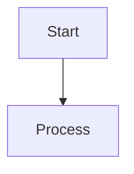
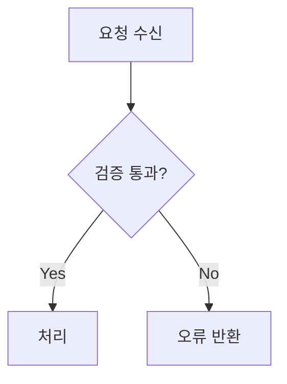
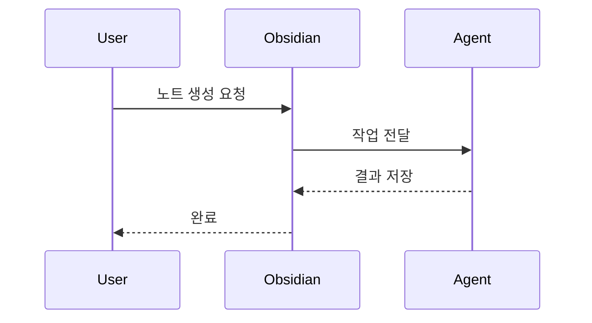
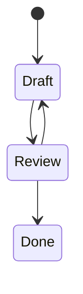
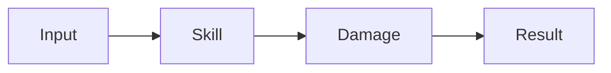

---
tags:
  - TileMapToolKit
type: standard
updated: 2026-03-05
---

# MERMAID_JUGGL_SYNTAX — Mermaid/Juggl 용법과 문법

## 1) Mermaid 기본 문법

### 코드블록 규칙

- 반드시 fenced code block 사용:





### 자주 쓰는 다이어그램 타입

#### Flowchart



#### Sequence



#### State



### Mermaid 작성 규칙

1. 노드 이름은 짧고 명확하게 유지
2. 분기 라벨은 `Yes/No` 또는 도메인 용어로 통일
3. 한 다이어그램에 흐름 1개만 담고, 복잡하면 파일 분리
4. 문서 본문에 다이어그램 목적 1문장 추가

## 2) Juggl 운용 문법 (링크 기반)

Juggl은 별도 DSL보다, 노트 간 링크/태그/메타데이터 구조 설계가 핵심이다.

### 핵심 연결 문법

#### 위키링크

```markdown
[[SkillSystem]]
[[Stat2EndDamage]]
[[docs/issues/ISSUE_INDEX]]
```

#### 블록 링크

```markdown
[[SkillSystem#핵심-흐름]]
[[SkillSystem^decision-20260305]]
```

#### 태그

```markdown
#project/topic-a #epic/logic #system/skill #status/in-progress
```

#### frontmatter 메타데이터

```yaml
---
type: issue
epic: logic
system: skill
status: in-progress
priority: high
---
```

### Juggl 활용 규칙

1. 허브 노트를 만든다: `ISSUE_INDEX`, `SYSTEM_INDEX`, `DECISIONS`
2. 각 노트는 최소 2개 이상의 내부 링크를 가진다
3. 고립 노트(링크 없음)는 주기적으로 정리한다
4. 태그/메타데이터 스키마를 고정해 필터링 정확도를 높인다

## 3) Mermaid + Juggl 결합 패턴

1. Juggl로 관계 공백 탐지
2. 핵심 흐름을 Mermaid로 명시화
3. Mermaid가 포함된 노트를 허브 노트에서 링크

### 결합 예시

~~~markdown
## 전투 처리 흐름



관련 노트: [[SkillSystem]], [[Stat2EndDamage]], [[CombatCore]]
~~~
