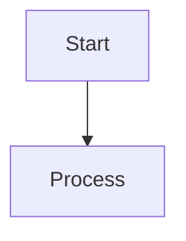
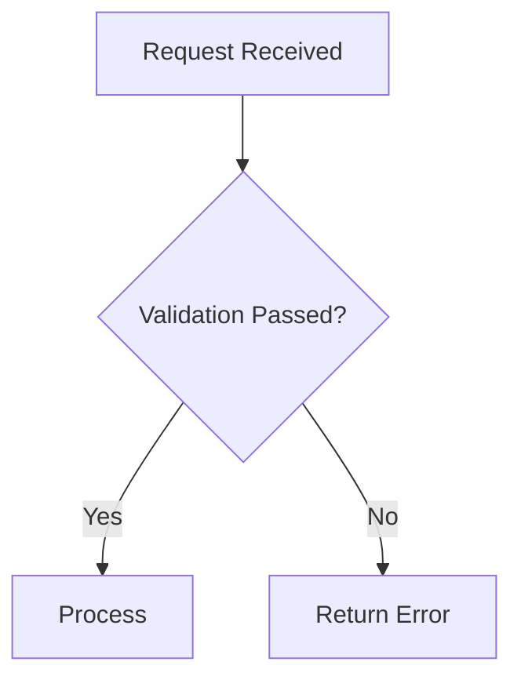
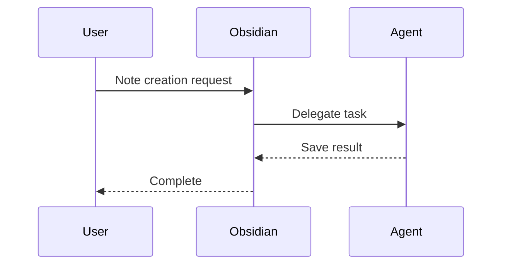
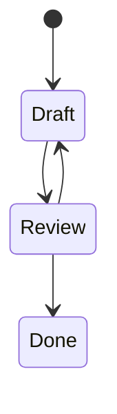
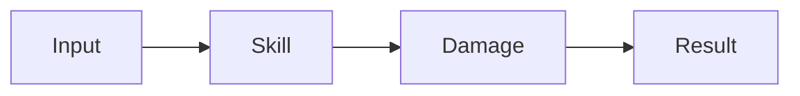

---
tags:
  - TileMapToolKit
type: standard
updated: 2026-03-05
---

# MERMAID_JUGGL_SYNTAX — Mermaid/Juggl Usage and Syntax

## 1) Mermaid Basic Syntax

### Code Block Rules

- Always use fenced code blocks:





### Commonly Used Diagram Types

#### Flowchart



#### Sequence



#### State



### Mermaid Writing Rules

1. Keep node names short and clear
2. Standardize branch labels as `Yes/No` or domain terms
3. One flow per diagram; split into separate files if complex
4. Add a one-sentence purpose statement for the diagram in the document body

## 2) Juggl Operational Syntax (Link-Based)

Juggl's core is not a separate DSL, but the design of inter-note links, tags, and metadata structure.

### Key Connection Syntax

#### Wiki Links

```markdown
[[SkillSystem]]
[[Stat2EndDamage]]
[[docs/issues/ISSUE_INDEX]]
```

#### Block Links

```markdown
[[SkillSystem#key-flow]]
[[SkillSystem^decision-20260305]]
```

#### Tags

```markdown
#project/topic-a #epic/logic #system/skill #status/in-progress
```

#### Frontmatter Metadata

```yaml
---
type: issue
epic: logic
system: skill
status: in-progress
priority: high
---
```

### Juggl Usage Rules

1. Create hub notes: `ISSUE_INDEX`, `SYSTEM_INDEX`, `DECISIONS`
2. Each note should have at least 2 internal links
3. Periodically clean up isolated notes (no links)
4. Fix tag/metadata schemas to improve filtering accuracy

## 3) Mermaid + Juggl Combined Patterns

1. Detect relationship gaps with Juggl
2. Formalize key flows with Mermaid
3. Link Mermaid-containing notes from hub notes

### Combined Example

~~~markdown
## Combat Processing Flow



Related notes: [[SkillSystem]], [[Stat2EndDamage]], [[CombatCore]]
~~~
