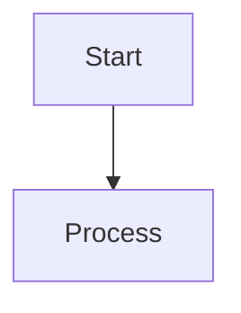
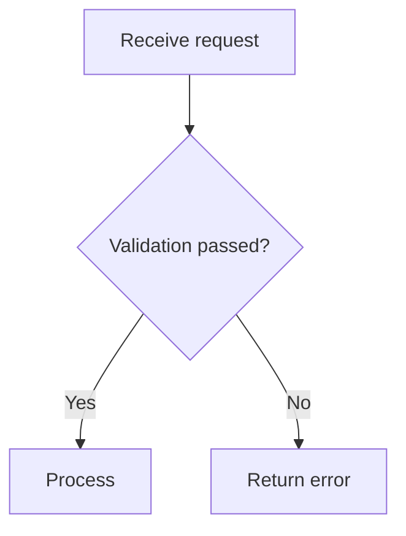
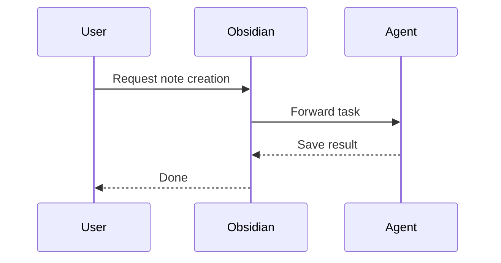
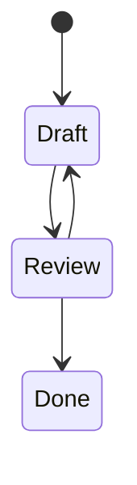
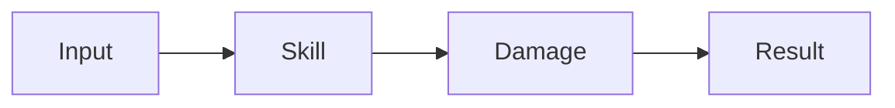

---
tags:
type: standard
updated: 2026-03-05
---

# MERMAID_JUGGL_SYNTAX — Mermaid / Juggl usage and syntax

## 1) Mermaid basics

### Code-block rules

- Always use a fenced code block:





### Common diagram types

#### Flowchart



#### Sequence



#### State



### Mermaid authoring rules

1. Keep node names short and clear
2. Unify branch labels as `Yes/No` or domain terms
3. Put one flow per diagram; split files when it gets complex
4. Add a one-sentence purpose for the diagram in the body text

## 2) Juggl usage (link-based)

Juggl has no dedicated DSL — the core is designing link / tag / metadata structure between notes.

### Core linking syntax

#### Wiki link

```markdown
[[SkillSystem]]
[[Stat2EndDamage]]
[[docs/issues/ISSUE_INDEX]]
```

#### Block link

```markdown
[[SkillSystem#core-flow]]
[[SkillSystem^decision-20260305]]
```

#### Tags

```markdown
#project/topic-a #epic/logic #system/skill #status/in-progress
```

#### Frontmatter metadata

```yaml
---
type: issue
epic: logic
system: skill
status: in-progress
priority: high
---
```

### Juggl usage rules

1. Create hub notes: `ISSUE_INDEX`, `SYSTEM_INDEX`, `DECISIONS`
2. Every note has at least 2 internal links
3. Clean up isolated notes (no links) periodically
4. Pin the tag / metadata schema to improve filter accuracy

## 3) Mermaid + Juggl combined pattern

1. Detect relationship gaps with Juggl
2. Make the core flow explicit with Mermaid
3. Link Mermaid-bearing notes from hub notes

### Combined example

~~~markdown
## Combat processing flow



Related notes: [[SkillSystem]], [[Stat2EndDamage]], [[CombatCore]]
~~~
