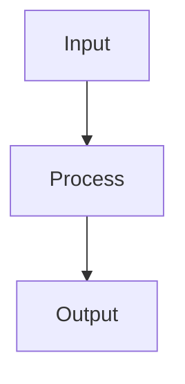

---
tags:
  - TileMapToolKit
type: plugin-standard
plugin: mermaid-tools
updated: 2026-03-05
---

# Mermaid Tools

## Features

- Authoring / editing aid for Mermaid code
- Review diagram rendering

## Main uses

- Document system flows, sequences, state transitions
- Produce visuals for architecture decisions

## Basic syntax entry

For detailed syntax, follow `MERMAID_JUGGL_SYNTAX.md`.
