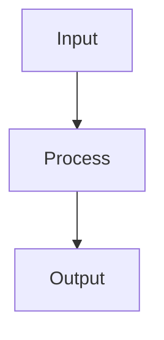

---
tags:
  - TileMapToolKit
type: plugin-standard
plugin: mermaid-tools
updated: 2026-03-05
---

# Mermaid Tools

## Features

- Mermaid code writing/editing assistance
- Diagram render review

## Primary Use Cases

- System flow, sequence, state transition documentation
- Visual aids for architecture decision-making

## Basic Syntax Entry Point

For detailed syntax, follow `MERMAID_JUGGL_SYNTAX.md`.
