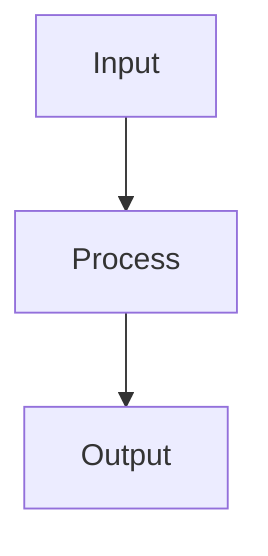

---
tags:
  - TileMapToolKit
type: plugin-standard
plugin: mermaid-tools
updated: 2026-03-05
---

# Mermaid Tools

## 기능

- Mermaid 코드 작성/수정 보조
- 다이어그램 렌더 검토

## 주 사용 작업

- 시스템 흐름도, 시퀀스, 상태 전이 문서화
- 아키텍처 의사결정 시 시각 자료 생성

## 기본 문법 진입점

상세 문법은 `MERMAID_JUGGL_SYNTAX.md`를 따른다.

