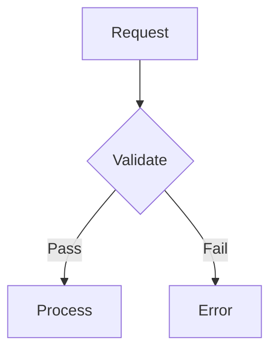
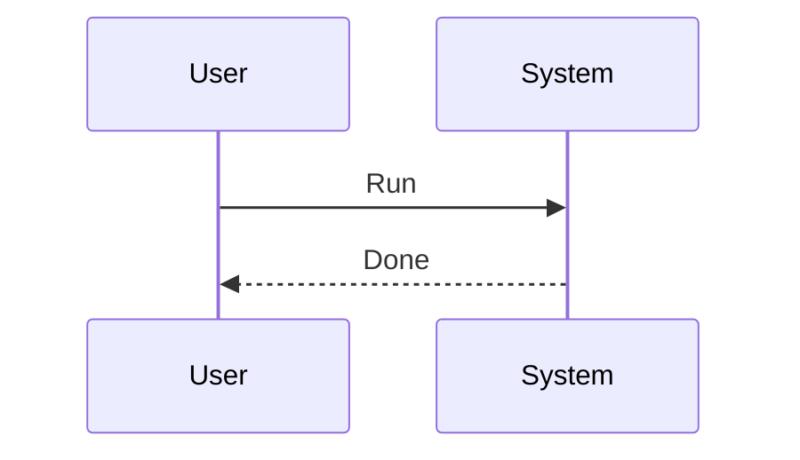
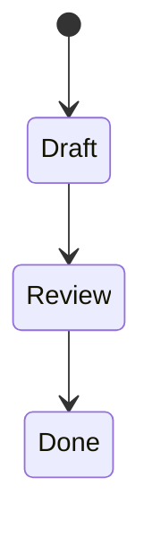

---
tags:
  - TileMapToolKit
type: standard
updated: 2026-03-05
---

# RENDERING_SKILL_DRILLS — Render / syntax fluency drills

## Purpose

- Reduce render failures in notes written jointly by AI and humans.
- Rapidly build proficiency with Mermaid / Juggl / Dataview / Tasks syntax.

## How to use

1. Run the drills below in order
2. Verify render results on the actual screen
3. On failure, record the cause and retry
4. After completion, summarize learning in `_STATUS.md` in 3 lines

## Drill 1: Basic Mermaid render

Success condition: the diagram renders as shapes, not text.



Check:
- Code block starts exactly with ` ```mermaid `
- Closing triple backticks are not missing

## Drill 2: Mermaid sequence + state

Success condition: both blocks render correctly.





## Drill 3: Build a Juggl link structure

Success condition: 0 isolated notes in the graph (for the target notes).

Steps:
1. Create three notes: `Skill_A`, `System_Index`, `Decision_Log`
2. Add links:
   - `System_Index` -> `[[Skill_A]]`, `[[Decision_Log]]`
   - `Skill_A` -> `[[System_Index]]`
   - `Decision_Log` -> `[[System_Index]]`

## Drill 4: Verify Dataview query

Success condition: incomplete items under `docs` print as a table.

```dataview
TABLE status, priority, updated
FROM "docs"
WHERE status != "done"
SORT updated desc
```

## Drill 5: Verify Tasks query

Success condition: the incomplete-tasks list prints.

```tasks
not done
path includes docs
sort by due
```

## Drill 6: Render-failure troubleshooting

When something fails, in order:
1. Check code-block fence pairs (`` ``` ``, `~~~`)
2. Check code-block language tag typos (`mermaid`, `dataview`, `tasks`)
3. Check frontmatter `---` block is closed
4. Check broken link syntax `[[...]]`
5. Check plugin is enabled

## Done criteria

- 3 Mermaid types render successfully
- Juggl graph connectivity verified
- Dataview / Tasks queries each run once successfully
- At least 1 failure case / fix recorded
