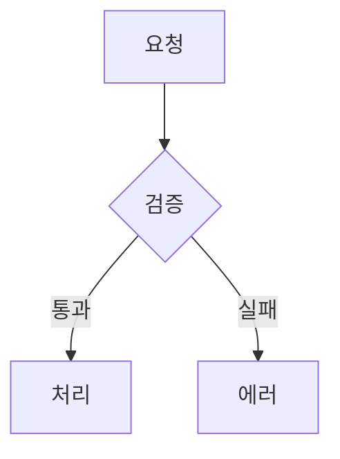
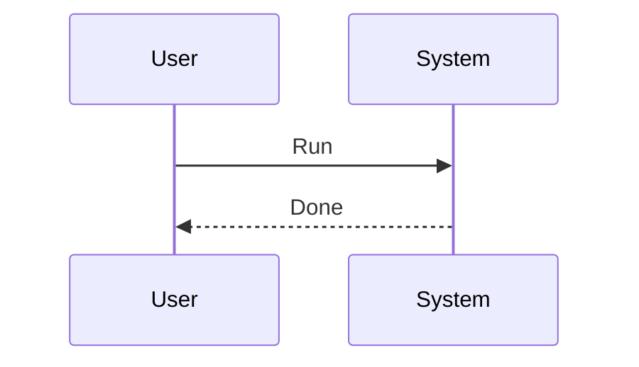
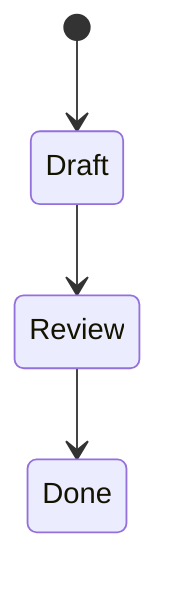

---
tags:
  - TileMapToolKit
type: standard
updated: 2026-03-05
---

# RENDERING_SKILL_DRILLS — 렌더/문법 활용력 강화 훈련 노트

## 목적

- AI와 사람이 함께 쓰는 노트에서 렌더 실패를 줄인다.
- Mermaid/Juggl/Dataview/Tasks 문법 숙련도를 빠르게 올린다.

## 사용 방법

1. 아래 드릴을 순서대로 수행
2. 렌더 결과를 실제 화면에서 확인
3. 실패 시 원인을 기록하고 재시도
4. 완료 후 `_STATUS.md`에 학습 결과 3줄 요약

## Drill 1: Mermaid 기본 렌더

성공 조건: 다이어그램이 텍스트가 아니라 도형으로 보인다.



체크:
- 코드블록 시작이 정확히 ` ```mermaid `
- 블록 끝에 백틱 3개 누락 없음

## Drill 2: Mermaid 시퀀스 + 상태도

성공 조건: 두 블록 모두 정상 렌더.





## Drill 3: Juggl 링크 구조 만들기

성공 조건: 그래프에서 고립 노트 0개(대상 노트 기준).

작업:
1. 아래 3개 노트를 생성: `Skill_A`, `System_Index`, `Decision_Log`
2. 링크 추가:
   - `System_Index` -> `[[Skill_A]]`, `[[Decision_Log]]`
   - `Skill_A` -> `[[System_Index]]`
   - `Decision_Log` -> `[[System_Index]]`

## Drill 4: Dataview 쿼리 확인

성공 조건: `docs` 하위 미완료 항목이 테이블로 출력.

```dataview
TABLE status, priority, updated
FROM "docs"
WHERE status != "done"
SORT updated desc
```

## Drill 5: Tasks 쿼리 확인

성공 조건: 미완료 태스크 목록이 출력.

```tasks
not done
path includes docs
sort by due
```

## Drill 6: 렌더 실패 트러블슈팅

문제 발생 시 순서:
1. 코드블록 fence(`````, `~~~`) 짝 확인
2. 코드블록 언어명 오탈자 확인 (`mermaid`, `dataview`, `tasks`)
3. frontmatter `---` 블록 닫힘 확인
4. 링크 문법 `[[...]]` 깨짐 확인
5. 플러그인 활성 상태 확인

## 완료 기준

- Mermaid 3종 렌더 성공
- Juggl 그래프 연결 확인
- Dataview/Tasks 쿼리 각각 1회 성공
- 실패 사례/해결법 1건 이상 기록
