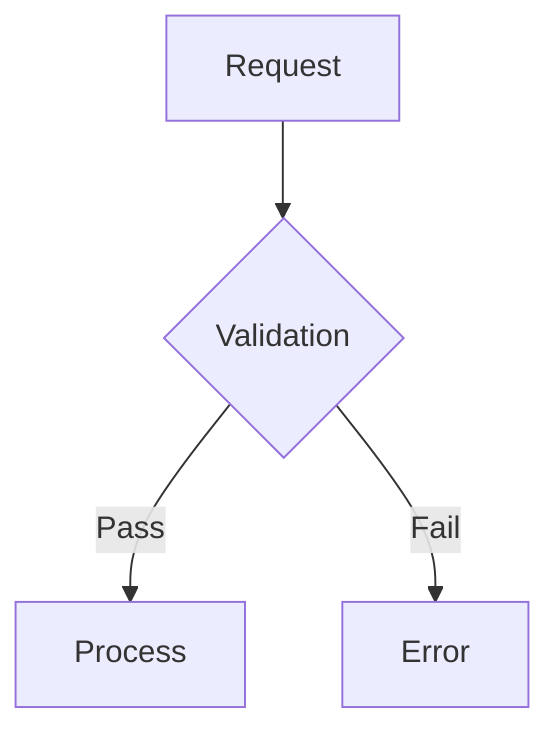
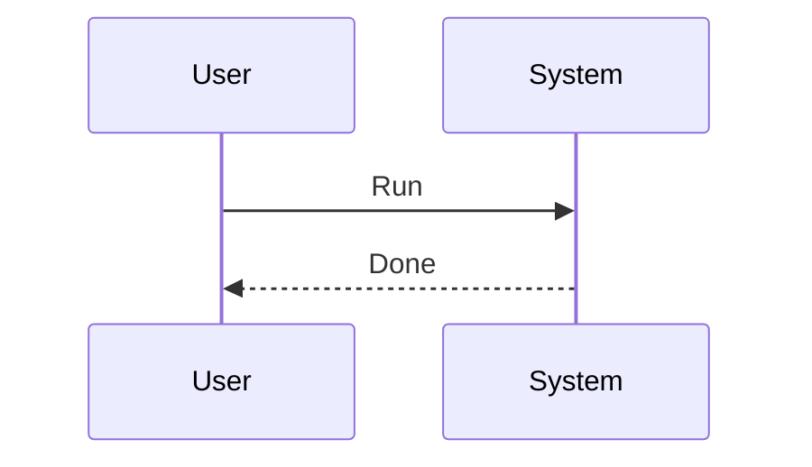
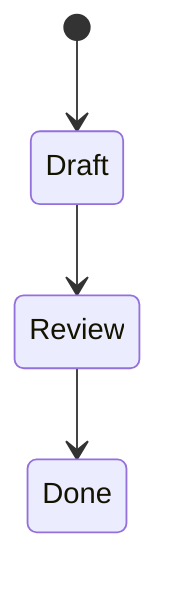

---
tags:
  - TileMapToolKit
type: standard
updated: 2026-03-05
---

# RENDERING_SKILL_DRILLS — Rendering/Syntax Proficiency Training Notes

## Purpose

- Reduce render failures in notes co-authored by AI and humans.
- Rapidly improve proficiency in Mermaid/Juggl/Dataview/Tasks syntax.

## How to Use

1. Complete the drills below in order
2. Verify render results on the actual screen
3. If failed, record the cause and retry
4. After completion, summarize learning results in 3 lines in `_STATUS.md`

## Drill 1: Mermaid Basic Render

Success criteria: Diagram appears as shapes, not text.



Check:
- Code block starts with exactly ` ```mermaid `
- No missing triple backticks at block end

## Drill 2: Mermaid Sequence + State Diagram

Success criteria: Both blocks render correctly.





## Drill 3: Build Juggl Link Structure

Success criteria: Zero isolated notes in graph (for target notes).

Tasks:
1. Create these 3 notes: `Skill_A`, `System_Index`, `Decision_Log`
2. Add links:
   - `System_Index` -> `[[Skill_A]]`, `[[Decision_Log]]`
   - `Skill_A` -> `[[System_Index]]`
   - `Decision_Log` -> `[[System_Index]]`

## Drill 4: Dataview Query Verification

Success criteria: Incomplete items under `docs` appear as a table.

```dataview
TABLE status, priority, updated
FROM "docs"
WHERE status != "done"
SORT updated desc
```

## Drill 5: Tasks Query Verification

Success criteria: Incomplete task list is displayed.

```tasks
not done
path includes docs
sort by due
```

## Drill 6: Render Failure Troubleshooting

When issues occur, follow this order:
1. Check code block fence pairs (`` ` `` `` ` `` `` ` ``, `~~~`)
2. Check for typos in code block language names (`mermaid`, `dataview`, `tasks`)
3. Verify frontmatter `---` block is properly closed
4. Check for broken link syntax `[[...]]`
5. Verify plugin activation status

## Completion Criteria

- 3 Mermaid types render successfully
- Juggl graph connections verified
- Dataview/Tasks queries each succeed once
- At least 1 failure case/resolution recorded
